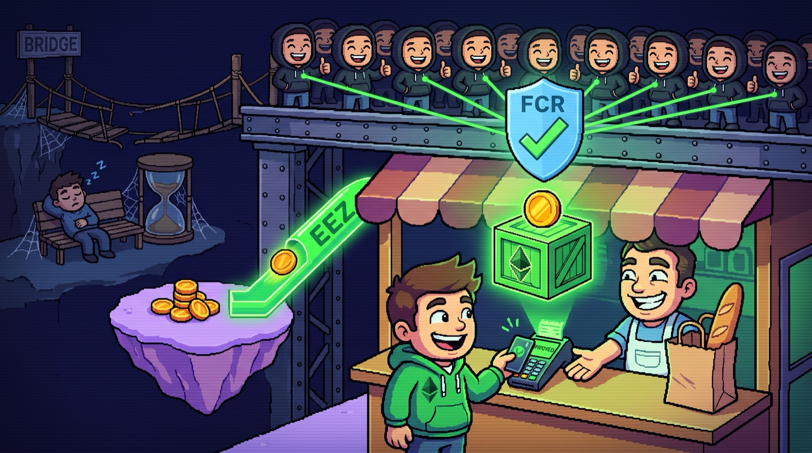

# Pay like a card, settle like Ethereum

*Card-terminal UX for payments from any rollup, with no bridge, no middleman and no one new to trust. That's what stacking FCR and EEZ unlocks: about two slots today, a card tap as Ethereum's slots shrink.*

You hold ETH on a rollup. The shop wants USDC and only watches Ethereum's base layer. It has never heard of your rollup, and it won't integrate yours or the next one. Multiply that by every rollup and every shop and you get the fragmentation everyone complains about: liquidity stuck on islands, each with its own bridge you have to trust and its own wait.

Two pieces of Ethereum infrastructure fix it together. [FCR](https://github.com/ethereum/consensus-specs/blob/master/specs/phase0/fast-confirmation.md) (the **Fast Confirmation Rule**) shrinks the wait before a landed block can be trusted. [EEZ](https://github.com/eez-association/eez-core-protocol) (the **Ethereum Economic Zone**) removes the separate crossing between your rollup and the base layer. They fix two different waits, so only stacked does the shop ship in seconds instead of minutes or days.

## The two waits

Any cross-layer payment has two separate waits stacked on top of each other, and they get fixed by two separate things:

- **Getting there**: your value has to actually leave the rollup and arrive where the shop can see it. Today that means trusting a bridge or a market maker to front the funds, or waiting out the rollup's own exit, up to about a week.
- **Being believed**: once something lands on the base layer, the shop has to be confident it's staying there before handing over the goods — a block can still be reorged for a while after it's included.

## Build it the way checkout works today

Without either fix, the shop integrates your rollup specifically, or it doesn't take your money. If it does, your ETH first has to get there: either you trust a market maker to front USDC against a promise of your ETH (fast, but now you're trusting someone), or you use the rollup's own canonical exit, which can take anywhere from a few minutes to about a week depending on how that rollup proves its state. Only once the money has actually arrived does the shop start its *own* clock — about 13 minutes for Ethereum's base layer to make that arrival practically irreversible. Repeat the integration work for every rollup you want to accept from.

## Fix 1: FCR shrinks the "being believed" wait

Think of a card payment at a physical checkout: "approved" flashes in a second or two and the clerk hands you the bag. It's provisional, resting on the card network's word, and in rare fraud cases it can still be clawed back; the irreversible settlement between the banks comes later. [FCR](https://github.com/ethereum/consensus-specs/blob/master/specs/phase0/fast-confirmation.md), merged into Ethereum's consensus specs on 2026-04-16, is that "approved" screen for a block:

- **Fast**: once enough validators have attested to a block, about one slot (~13 seconds) after it lands, a node can mark it `safe` and act on it, instead of waiting ~13 minutes for full, slashing-backed finality.
- **Conditional**: it assumes attestations arrive on time and no more than 25% of stake acts adversarially. Break those and, unlike finality, nobody gets slashed; the rule just falls back to waiting for finality.
- **No fork needed**: it's a client-side rule, not a network upgrade. Some consensus clients ship it today, others are still in release candidates.

## Fix 2: EEZ removes the "getting there" wait

The bridge model is a wire transfer: your ETH leaves your rollup's ledger, sits in transit, and lands on the base layer's ledger later, and if the transfer breaks halfway you can be stuck with nothing on either side. [EEZ](https://eez.io), a shared zone of rollups [built by Gnosis and ZisK with Ethereum Foundation co-funding](https://x.com/etheconomiczone/status/2038271122907578375), instead writes one receipt both ledgers sign off on together:

- **One block**: a builder packages your rollup action and the base-layer action into the same Ethereum block. Your rollup's contract only accepts the update once the base layer has recorded it in that block (the code calls this `postAndVerifyBatch`), and the rollup's own ledger mirrors it on the spot.
- **Nothing to trust in between**: no bridge operator or market maker ever holds your money mid-crossing. The base layer accepts your rollup's side only with a proof, so EEZ removes the trusted step, not just the wait. (Today's demo used a stand-in signer for that proof.)
- **All or nothing**: either the whole package lands or none of it does, so there's no half-sent state to get stuck in.
- **Composable**: by design the pieces can call each other and hand back results, so "swap on the base layer, then send the change back to your rollup" is one package, not three separate trips.

## Alike, different, and where they meet

They don't compete, and they aren't the same feature wearing two names. FCR works on any Ethereum block, checkout or not, and lives in the consensus client every validator already runs. EEZ only works for actions between contracts inside its zone, and lives in a specific, still-unaudited set of rollup and base-layer contracts. They compose for one simple reason: EEZ's atomic package still lands as one ordinary Ethereum block, and FCR doesn't care what's inside a block to confirm it fast.

## Four ways to build your checkout

- **Neither.** Today's checkout: a bridge (minutes, trusted, or up to about a week, trustless) and then ~13 minutes of finality. The bridge usually dominates.
- **FCR only.** The bridge still has to run first, and you still have to trust it: FCR doesn't touch the crossing. Once the money has arrived, the shop's own wait drops from ~13 minutes to ~13 seconds. Still bridge-bound.
- **EEZ only.** The crossing disappears, and the bridge you had to trust goes with it: your rollup action and the base-layer action land as one package, one block. But the shop still has no fast-confirmation rule to lean on, so it waits the full ~13 minutes of finality to be sure that block is staying put.
- **Both.** One package, one block, confirmed in about two slots — the one it lands in, plus one more for FCR — roughly 25 seconds, assuming FCR's own conditions hold. This is the only quadrant that's fast, has no bridge to trust, *and* is a single integration.

## Both together: on the way to card speed

You sign once. A builder puts your rollup's side (send ETH, get change back) and the base-layer side (swap into USDC, pay the invoice) in one Ethereum block. The shop never has to know your rollup exists: it watches the base layer, sees the block land, sees FCR mark it `safe` a slot later, and ships. Two slots, one integration, no bridge to trust. [The first atomic transaction of this kind](https://x.com/eduadiez/status/2107159200086319334) landed on mainnet on 2026-10-05: a much simpler transfer than this checkout, but built from the same pieces.

Twenty-five seconds still isn't a card tap. But **the whole checkout is counted in slots, not seconds**, so every cut to Ethereum's slot time cuts the wait with it:

[EIP-7782](https://eips.ethereum.org/EIPS/eip-7782), still a draft, proposes 6-second slots, and [Vitalik's roadmap sketch](https://x.com/VitalikButerin/status/2026779557479723418) keeps stepping them down, 12 → 8 → 6 → 4 → 3 → 2, with the last two steps still speculative. At 2-second slots the checkout takes about 5 seconds, close to the pause you already accept at a card terminal: you tap your phone, the shop sees `safe`, and the bag crosses the counter.

Only the stack rides that curve. Shorter slots don't shorten a bridge's exit window, and with today's finality the shop would still wait 64 slots, over two minutes even at 2-second slots. EEZ and FCR together turn the checkout into two slots, and two slots keep getting shorter.

## Cheat sheet

