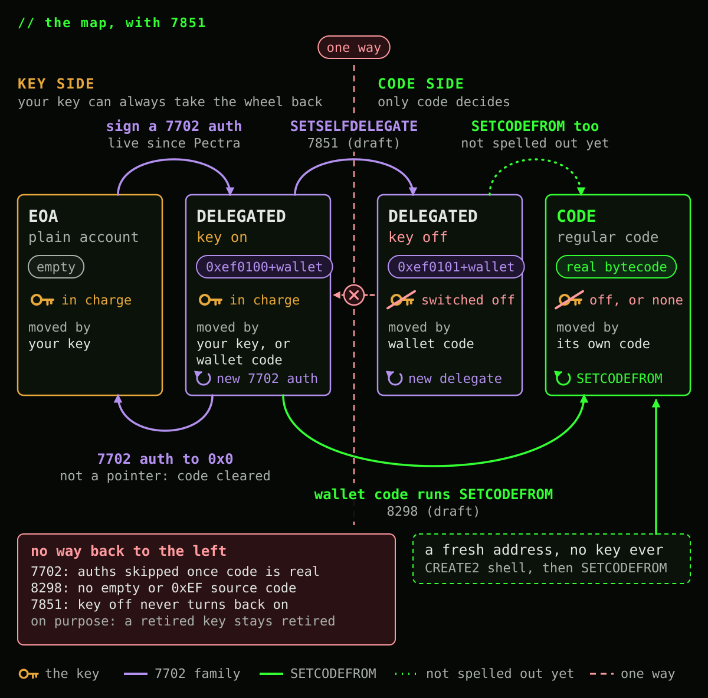
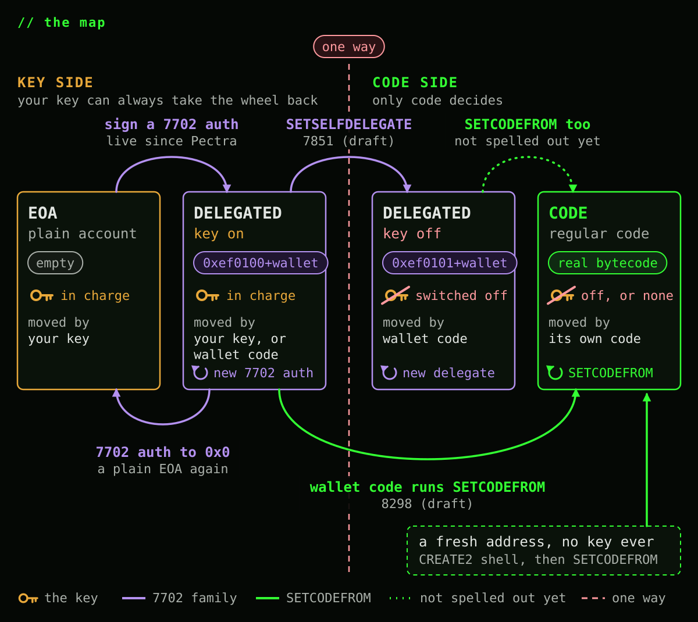
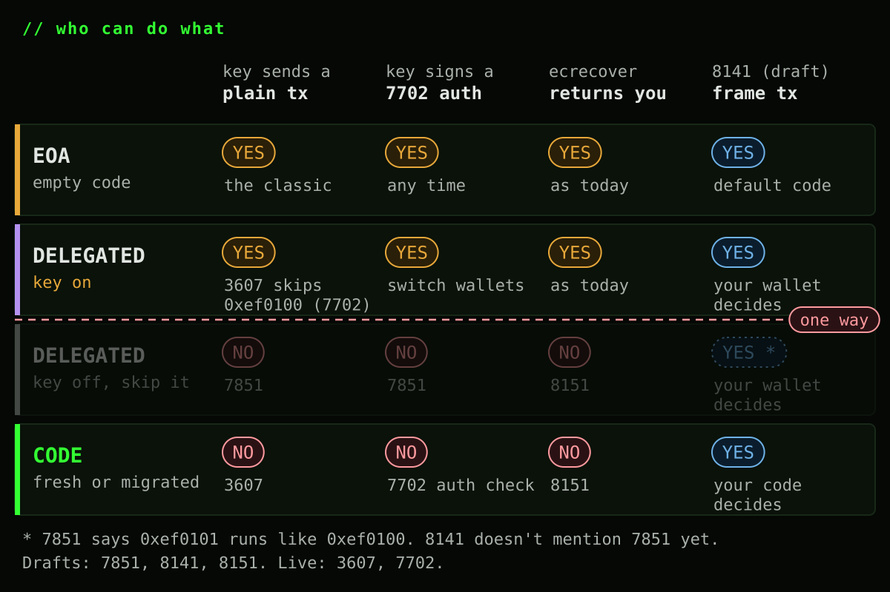
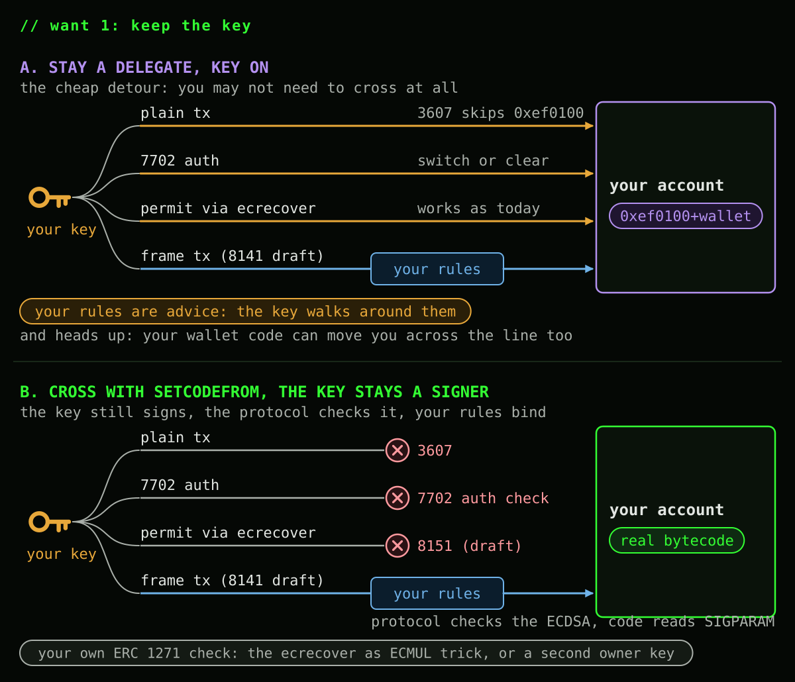
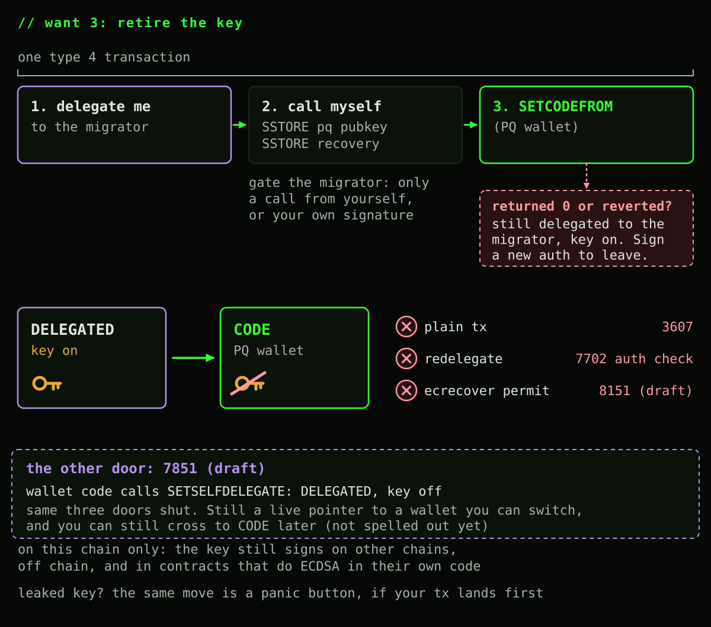
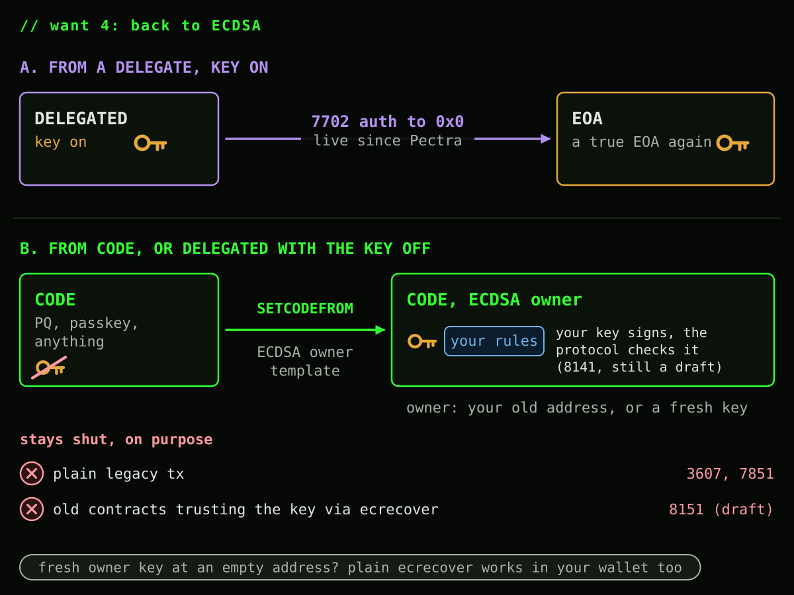

# What your account can become after SETCODEFROM

*Four things people keep asking for, a few they will ask next, and which EIP opens each door.*

[SETCODEFROM](https://eips.ethereum.org/EIPS/eip-8298) is one instruction with a small job: point your account's code hash at another contract's already deployed code. It only ever touches the account running it, it never installs empty code or a delegation indicator, and the fee is flat no matter how big the code you're adopting is. That's the whole opcode.

What it opens up is bigger than the opcode. Once your account can pick up real code on demand, "what kind of account do I want to be" becomes an actual menu. So here's the menu, mostly in pictures:

1. Move to a code account, but keep signing with my own ECDSA key
2. Deploy a contract that never had a dangling key in the first place
3. Retire the ECDSA key for good
4. Come back to ECDSA from a code account

A few of these lean on EIPs that are still drafts, and one leans on a PR that isn't merged yet. I'll flag those as they show up. 7702 and 3607 are already live.

## The shapes and the line

Left of the line, your key is always the one steering: it can delegate, redelegate, or clear itself back to a plain EOA whenever it wants. Cross the line and steering changes hands to whatever code you adopted. That's not a bug, it's the entire point of retiring a key.

[EIP-7851](https://eips.ethereum.org/EIPS/eip-7851) (draft) is the third box: a delegate that switches its own key off with `SETSELFDELEGATE`. Look at where it lands though. No plain transactions, no redelegation, no `ecrecover`, and a wallet that only code can change. That's exactly what a code account gives you, and SETCODEFROM gets you there in the same single move, swaps the wallet later just as easily, and doesn't add a second indicator format (`0xef0101`) that other EIPs like 8141 don't even mention yet. So it doesn't really buy us anything. We should probably skip it, and just aim to ship the best version of SETCODEFROM possible. Without it, the map gets simpler:

A few things this map says on purpose:

- SETCODEFROM is self only. It can never reach out and change somebody else's account.
- The arrow back from CODE is red because the specs block it, not because I left it off. 8298 only accepts a source whose code hash isn't the empty one and whose code doesn't start with `0xEF`, so SETCODEFROM can't copy "no code" or a 7702 indicator onto you. 7702 skips any authorization from an account that already has real code (its authority must be "empty or already delegated"). And `SELFDESTRUCT` only deletes a contract created in the same transaction ([EIP-6780](https://eips.ethereum.org/EIPS/eip-6780)), which a migrated account never is. Nothing else writes an account's code.
- Why that's a feature: 8298 says ECDSA transaction origination "remains permanently disabled" after a migration. If code could turn itself back into a key account, a retired, leaked or quantum broken key would get the account back, and for a fresh contract so would anyone who found a colliding key. Code can still adopt a new implementation as often as it likes. It just stays code.
- A 7702 authorization to `0x0` is not a delegation to address zero. 7702 treats it as "clear": the code hash goes back to empty, no indicator is left behind, and the account is a plain EOA again, byte for byte (geth does exactly this). Your key sends normal transactions, `ecrecover` works, and 8141 gives you the protocol's default code. No contract runs, no Solidity is involved. Only your key can make this move, and only from a delegate with the key on.

## Who can do what

Three separate rules close the door on your key, one at a time, and none of them talk to each other: [EIP-3607](https://eips.ethereum.org/EIPS/eip-3607) blocks plain transactions from any address with real code, the [EIP-7702](https://eips.ethereum.org/EIPS/eip-7702) authorization check blocks redelegating an address that already has real code, and [EIP-8151](https://eips.ethereum.org/EIPS/eip-8151) (draft) blocks `ecrecover` from ever returning that address again. Add them up and a key behind real code has nothing left on this chain.

Why not let each account choose whether `ecrecover` still works? Because the contracts it matters for can't ask your account anything. An [ERC-2612](https://ercs.ethereum.org/ERCS/erc-2612) `permit` just runs `ecrecover` on a bare `v, r, s`. If that kept working after you moved to code, your old key could still sign away your tokens there, skipping your wallet's rules, and forever if the key leaks or gets broken. Contracts that ask your account through ERC 1271 keep working, and there your wallet decides.

If you want plain `ecrecover` apps to keep trusting your key, stay a delegate with the key on. The choice is the shape.

## Want 1: a code account that still runs on your ECDSA key

**Stay a delegate.** Your key keeps everything: plain transactions, switching or clearing the delegation, and `permit` through `ecrecover`. Fully reversible. The catch: your wallet's rules are only advice, since the key can walk around them, and your wallet code can move you across the line without your key, so pick it like you'd pick a key.

**Cross with SETCODEFROM.** Adopt a wallet template that approves [8141 frame transactions](https://eips.ethereum.org/EIPS/eip-8141) signed by your key. The protocol verifies that signature natively before any code runs, the same way it checks a normal transaction signature. Your code only reads who signed (`SIGPARAM`) and applies its rules. No Solidity ECDSA, no precompile call. And since the key has no side door left, those rules actually bind.

This doesn't undo SETCODEFROM. The key has no power of its own anymore: your code chooses to trust it, the same way it could trust a passkey, and a template that stops accepting it retires it.

What you give up: plain transactions, and contracts that only run `ecrecover` (8151). Contracts that ask your account through ERC 1271 still work, but there your code checks the signature itself and `ecrecover` won't return your own address. Use the [ECMUL trick](https://ethereum-magicians.org/t/eip-8151-account-code-restricted-ecrecover/27690) (one `ecrecover` plus a `MODEXP` or two) or a second owner key whose address has no code.

## Want 2: a contract with no key at all

This is the other half of what SETCODEFROM is for: deploying a contract whose code is already on chain, without paying to store those bytes again. The new account just points at the existing code. And because that account never had a key, nothing is left dangling that someone has to remember to switch off.

Under [EIP-8037](https://eips.ethereum.org/EIPS/eip-8037) (in review) every byte of new code costs 1530 gas, so a 24 KiB contract pays about 37.6M gas in code deposit, even when the exact same bytes are already on chain. With SETCODEFROM a factory deploys a tiny shell with `CREATE2`, calls it once to write per instance state, and the shell adopts the template's code for a flat 9300 gas warm or 12200 cold, whatever its size. You still pay for the new account itself, like any deployment, because that part really is new state.

The result is as keyless as any ordinary contract, and it costs nothing extra to get there. No key ever existed at that address, so a hypothetical `2^80` collision key gets nothing (3607, the 7702 authority check, and 8151 all shut it out the same way they shut out a real key). Compare that to a 7702 wallet, which by definition always carries a live key that can act outside the wallet's rules. There's no "remember to disable something" step for a clone, because there was never anything to disable.

In the current draft text this is a one transaction deploy only when it goes through a factory; a plain nil `to` create transaction still needs a second call to run the initializer, since `SETCODEFROM` halts inside initcode today. [PR #12356](https://github.com/ethereum/EIPs/pull/12356) removes that halt with a small deposit step guard, making the whole thing one step everywhere, including a direct create transaction. Counterfactual smart wallets, where the address exists before any code does, follow the same shape through an 8141 deploy frame and the [EIP-7997](https://eips.ethereum.org/EIPS/eip-7997) deterministic factory (currently in Review).

## Want 3: retire the key for good

One transaction can do the whole migration. Sign a 7702 authorization to a migrator contract, call yourself so the migrator's code runs in your context, have it store your post quantum public key and recovery config, then call `SETCODEFROM` on a shared wallet template and revert if that call returns zero. All three doors close together: plain transactions (3607), redelegation (the 7702 authority check), and third party `ecrecover` (8151, draft).

Gate that migrator carefully. A 7702 delegation write survives even if the rest of the transaction reverts, so if the migration call fails partway, you're left delegated to the migrator with your key still live, and anyone who can call it can install their own key instead of yours. Restrict it to a call from yourself, or a signature only you could produce, and if a call does fail, you can still sign a fresh authorization to leave.

There's a sibling door for this that doesn't go through `SETCODEFROM` at all: [EIP-7851](https://eips.ethereum.org/EIPS/eip-7851) (draft) lets delegated wallet code call `SETSELFDELEGATE`, flipping the indicator from `0xef0100` to `0xef0101`. Same three doors close. The difference is you're still a live pointer, not regular code, so the wallet can still switch delegates later, and it can still cross into a real code account afterward, though that particular hop isn't spelled out in either spec yet.

And keep the scope honest either way: this only closes doors on this chain. The same key still signs on chains where that address carries no code, still works off chain, and any contract doing its own ECDSA math in Solidity never asks the precompile at all. One more symmetry worth remembering: if you're racing to lock down a key you suspect leaked, this exact move is your panic button, but it's a race. Whoever's transaction lands first, you or whoever has the leaked key, wins.

## Want 4: back to ECDSA

Two different starting points, two different answers. If you're still a plain 7702 delegate with the key on, a fresh authorization to `0x0` clears you straight back to a true EOA, no different from one that never delegated.

If you're already a code account, or a delegate that locked its key off with `SETSELFDELEGATE`, there's no clearing your way out. What you can do is adopt an "ECDSA owner" template with `SETCODEFROM`, whose validator reads a signature through 8141 and checks it against an owner address, your original one or a fresh one. The key is back driving, just through the wallet's front door this time, with your rules still applying to it.

What stays shut, deliberately: plain legacy transactions (3607, and 7851 if you came from a locked delegate) and any third party contract trusting that address through naive `ecrecover` (8151). Nothing about 3607 or 7851 was actually reversed, since what came back is your code choosing to trust a signature, exactly the way it could choose to trust a passkey or a post quantum scheme instead. If you'd rather have plain `ecrecover` work again too, park a fresh owner key at a brand new, empty address and check that one inside your wallet.

This same "adopt a new template, same address, same storage, no proxy" trick is also just how you upgrade in place at any point along the way: ECDSA today, a passkey tomorrow through 8141's `P256` scheme or the [secp256r1 precompile](https://eips.ethereum.org/EIPS/eip-7951) directly, a post quantum scheme after that through an `ARBITRARY` signature entry. Proxies can graduate into this too, since delegated execution is allowed to adopt code for its caller, but once you do, the proxy's old upgrade slot is dead weight: graduate only into code whose own upgrade path is `SETCODEFROM` from here on.

## Cheat sheet

**Verdict:** only two things are actually irreversible on this chain, protocol level ECDSA authority and blind `ecrecover` trust, and both are irreversible by design, not by accident. Everything else on this page, including coming back, is a move your own code or your own key can make, and every single one has an EIP number sitting right next to it.
