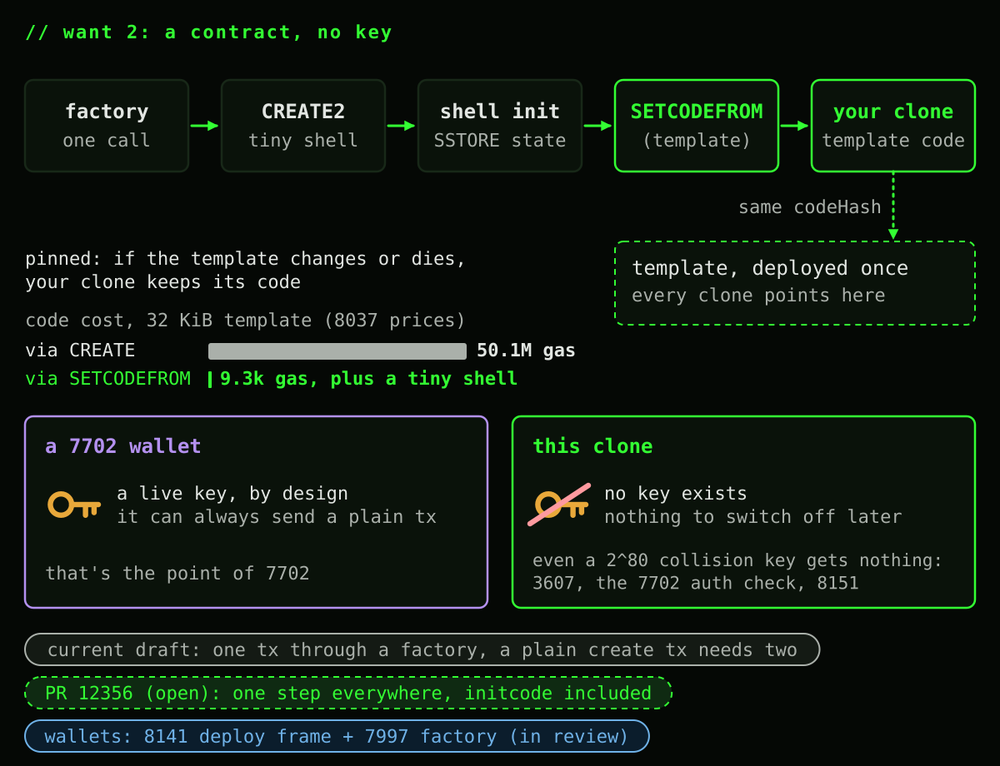

# What your account can become after SETCODEFROM

*Four things people keep asking for, a few they will ask next, and which EIP opens each door.*

[SETCODEFROM](https://eips.ethereum.org/EIPS/eip-8298) is one instruction with a small job: point your account's code hash at another contract's already deployed code. It only ever touches the account running it, it never installs empty code or a delegation indicator, and the fee is flat no matter how big the code you're adopting is. That's the whole opcode.

What it opens up is bigger than the opcode. Once your account can pick up real code on demand, "what kind of account do I want to be" becomes an actual menu. So here's the menu, mostly in pictures:

1. Move to a code account, but keep signing with my own ECDSA key
2. Deploy a contract that never had a dangling key in the first place
3. Retire the ECDSA key for good
4. Come back to ECDSA from a code account

A few of these lean on EIPs that are still drafts, and one lean on a PR that isn't merged yet. I'll flag those as they show up. 7702 and 3607 are already live.

## The shapes and the line

Left of the line, your key is always the one steering: it can delegate, redelegate, or clear itself back to a plain EOA whenever it wants. Cross the line and steering changes hands to whatever code you adopted. That's not a bug, it's the entire point of retiring a key.

A few of the missing arrows are worth calling out on purpose:

- SETCODEFROM is self only. It can never reach out and change somebody else's account.
- It can never install empty code or a `0xEF` delegation indicator, so nothing goes left across the line, ever.
- Only your key can leave a plain EOA, and only your key can bring a delegate back to one, with a fresh 7702 authorization to `0x0`.
- Once code is driving, it can't hand the wheel back to a plain key. It can adopt a new implementation, sure, but the account stays a code account.
- SETCODEFROM in initcode currently halts. There's an open PR, [#12356](https://github.com/ethereum/EIPs/pull/12356), that lifts that ban with one small guard in the deposit step. More on that in want 2.
- A code update through SETCODEFROM reverts with its transaction, same as any other state change. A 7702 delegation write does not: if the rest of the transaction reverts, the delegation still lands.
- Two very different things can point at "the same code": a delegation indicator follows whatever its delegate currently runs, live. SETCODEFROM pins a code hash forever, even if the source later changes or dies. Pick the one you actually want.

## Who can do what

Three separate rules close the door on your key, one at a time, and none of them talk to each other: [EIP-3607](https://eips.ethereum.org/EIPS/eip-3607) blocks plain transactions from any address with real code, the [EIP-7702](https://eips.ethereum.org/EIPS/eip-7702) authorization check blocks redelegating an address that already has real code, and [EIP-8151](https://eips.ethereum.org/EIPS/eip-8151) (draft) blocks `ecrecover` from ever returning that address again. Add them up and a key behind real code has nothing left on this chain.

8141 frame transactions ([draft](https://eips.ethereum.org/EIPS/eip-8141)) are the fourth channel, and they don't route around those three, they route through your code instead: a plain EOA gets a protocol default check for free, everyone else gets whatever their own code decides to approve.

And "nothing left on this chain" is the honest scope of it. Your key still signs on any chain where that address has no code, still works off chain, and any contract doing plain secp256k1 math in its own Solidity keeps trusting it. These rules only bind what this chain's own precompile and validation rules do.

## Want 1: a code account that still runs on your ECDSA key

**The cheap detour first.** If all you want is to keep your key in charge, you don't have to cross anything. Stay a plain 7702 delegate. Your key can always send a legacy transaction (7702 lifts 3607 for delegated code), switch or clear the delegation whenever it likes, and any old `permit` style contract still recognizes it through `ecrecover` (8151 exempts a plain `0xef0100` indicator). It's fully reversible. The catch: your wallet's own rules, limits, cosigners, whatever you built, are advice, not law. The key can always walk around them with a plain transaction or a new delegation. And your wallet's own code can move you across the line without needing your key at all, so pick it as carefully as you'd pick a key.

**Now the thing you actually asked for.** Have the wallet's own logic run `SETCODEFROM` on itself, so the account becomes a real code account whose validator is roughly "check that `SIGPARAM(0, 0x00)` equals me and the scheme is `SECP256K1`". Your original key still signs every transaction. The difference is the protocol does the ECDSA check natively through an 8141 frame transaction, never a Solidity reimplementation, and your wallet's cosigners and limits actually bind now, because 3607 and the 7702 authority check have closed the key's side doors.

The trade you're making is explicit: legacy transaction types stop working for that address, and third party contracts trusting your address via naive `ecrecover` get a zero back, on purpose, so a leaked or quantum broken key can't keep spending at contracts that will never be upgraded. Contracts that already check for a code owner and fall back to ERC 1271 still work fine. If your own code wants to verify that same historical key, say for an ERC 1271 style check, it can use the [ecrecover as ECMUL trick](https://ethereum-magicians.org/t/eip-8151-account-code-restricted-ecrecover/27690) (about one `ecrecover` plus a `MODEXP` or two, nowhere near a full Solidity ECDSA implementation, though it needs its own signature shape, not a drop in replacement for existing 1271 code), or just keep a second owner key at an address with no code, where plain `ecrecover` is untouched.

One more route worth a line: a wallet that remembers its own original implementation address can expose a "graduate" function that calls `SETCODEFROM` on itself later, moving from delegate to code account whenever it wants. `SETCODEFROM(address(this))` from delegated code fails, since your account's own code is the `0xEF...` indicator at that point, so this only works pointing at the actual implementation.

Without 8141, none of this native path exists yet. A code account can't originate anything itself either way (3607), so it needs a relayer or bundler to call it, and its own key check runs entirely in its own code.

## Want 2: a contract with no key at all

This is the other half of what the opcode is for: cheap clones. A factory deploys a tiny shell with `CREATE2`, calls it once to write whatever per instance state it needs, then the shell adopts a shared template's code with `SETCODEFROM`. The clone pays a flat adoption fee, 9300 gas warm or 12200 cold in the current draft's own numbers, no matter how big the template is, because it's a pointer update to code that's already stored, not a fresh deposit.

The result is as keyless as any ordinary contract, and it costs nothing extra to get there. No key ever existed at that address, so a hypothetical `2^80` collision key gets nothing (3607, the 7702 authority check, and 8151 all shut it out the same way they shut out a real key). Compare that to a 7702 wallet, which by definition always carries a live key that can act outside the wallet's rules. There's no "remember to disable something" step for a clone, because there was never anything to disable.

In the current draft text this is a one transaction deploy only when it goes through a factory; a plain nil `to` create transaction still needs a second call to run the initializer, since `SETCODEFROM` halts inside initcode today. PR #12356 removes that halt with a small deposit step guard, making the whole thing one step everywhere, including a direct create transaction. Counterfactual smart wallets, where the address exists before any code does, follow the same shape through an 8141 deploy frame and the [EIP-7997](https://eips.ethereum.org/EIPS/eip-7997) deterministic factory (currently in Review).

## Want 3: retire the key for good

One transaction can do the whole migration. Sign a 7702 authorization to a migrator contract, call yourself so the migrator's code runs in your context, have it store your post quantum public key and recovery config, then call `SETCODEFROM` on a shared wallet template and revert if that call returns zero. All three doors close together: plain transactions (3607), redelegation (the 7702 authority check), and third party `ecrecover` (8151, draft).

Gate that migrator carefully. A 7702 delegation write survives even if the rest of the transaction reverts, so if the migration call fails partway, you're left delegated to the migrator with your key still live, and anyone who can call it can install their own key instead of yours. Restrict it to a call from yourself, or a signature only you could produce, and if a call does fail, you can still sign a fresh authorization to leave.

There's a sibling door for this that doesn't go through `SETCODEFROM` at all: [EIP-7851](https://eips.ethereum.org/EIPS/eip-7851) (draft) lets delegated wallet code call `SETSELFDELEGATE`, flipping the indicator from `0xef0100` to `0xef0101`. Same three doors close. The difference is you're still a live pointer, not regular code, so the wallet can still switch delegates later, and it can still cross into a real code account afterward, though that particular hop isn't spelled out in either spec yet.

And keep the scope honest either way: this only closes doors on this chain. The same key still signs on chains where that address carries no code, still works off chain, and any contract doing its own ECDSA math in Solidity never asks the precompile at all. One more symmetry worth remembering: if you're racing to lock down a key you suspect leaked, this exact move is your panic button, but it's a race. Whoever's transaction lands first, you or whoever has the leaked key, wins.

## Want 4: back to ECDSA

Two different starting points, two different answers. If you're still a plain 7702 delegate with the key on, a fresh authorization to `0x0` clears you straight back to a true EOA, no different from one that never delegated.

If you're already a code account, or a delegate that locked its key off with `SETSELFDELEGATE`, there's no clearing your way out. What you can do is adopt an "ECDSA owner" template with `SETCODEFROM`, whose validator reads a signature through 8141 and checks it against an owner address, your original one or a fresh one. The key is back driving, just through the wallet's front door this time, with your rules still applying to it.

What stays shut, deliberately: plain legacy transactions (3607, and 7851 if you came from a locked delegate) and any third party contract trusting that address through naive `ecrecover` (8151). Nothing about 3607 or 7851 was actually reversed, since what came back is your code choosing to trust a signature, exactly the way it could choose to trust a passkey or a post quantum scheme instead. If you'd rather have plain `ecrecover` work again too, park a fresh owner key at a brand new, empty address and check that one inside your wallet.

This same "adopt a new template, same address, same storage, no proxy" trick is also just how you upgrade in place at any point along the way: ECDSA today, a passkey tomorrow through 8141's `P256` scheme or the [secp256r1 precompile](https://eips.ethereum.org/EIPS/eip-7951) directly, a post quantum scheme after that through an `ARBITRARY` signature entry. Proxies can graduate into this too, since delegated execution is allowed to adopt code for its caller, but once you do, the proxy's old upgrade slot is dead weight: graduate only into code whose own upgrade path is `SETCODEFROM` from here on.

## Cheat sheet

**Verdict:** only two things are actually irreversible on this chain, protocol level ECDSA authority and blind `ecrecover` trust, and both are irreversible by design, not by accident. Everything else on this page, including coming back, is a move your own code or your own key can make, and every single one has an EIP number sitting right next to it.
