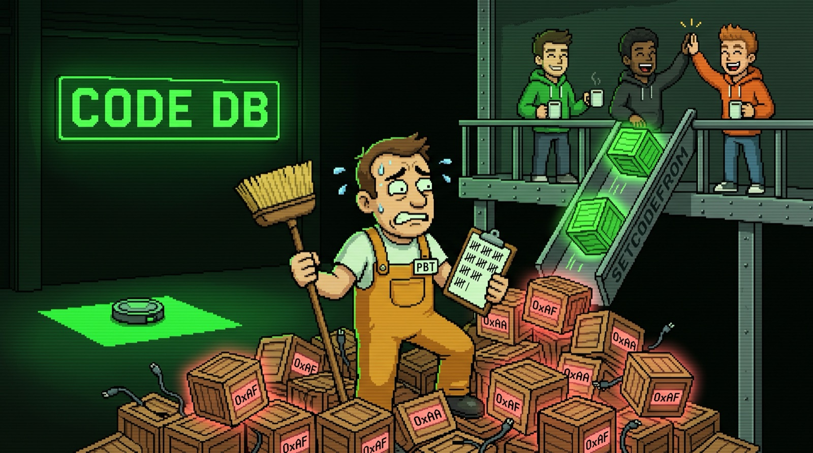
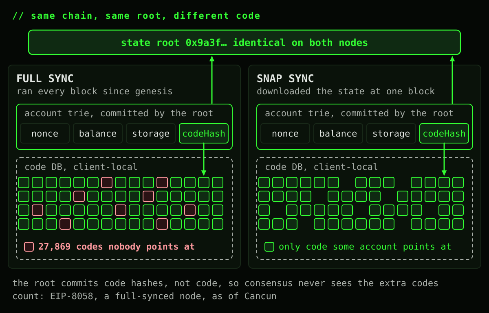
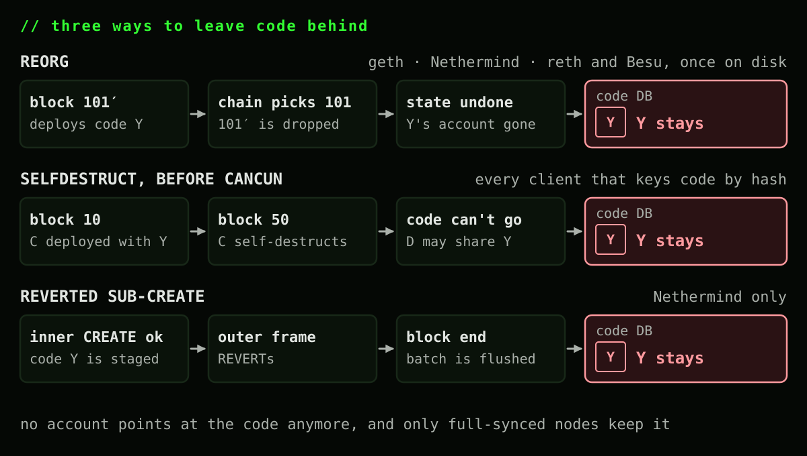
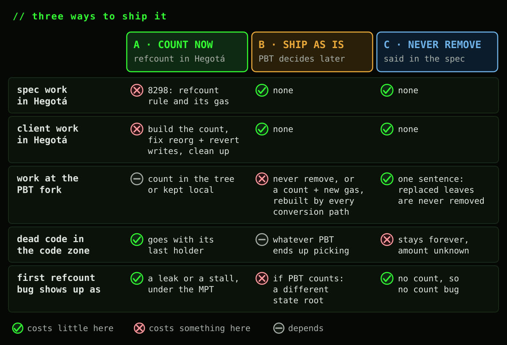
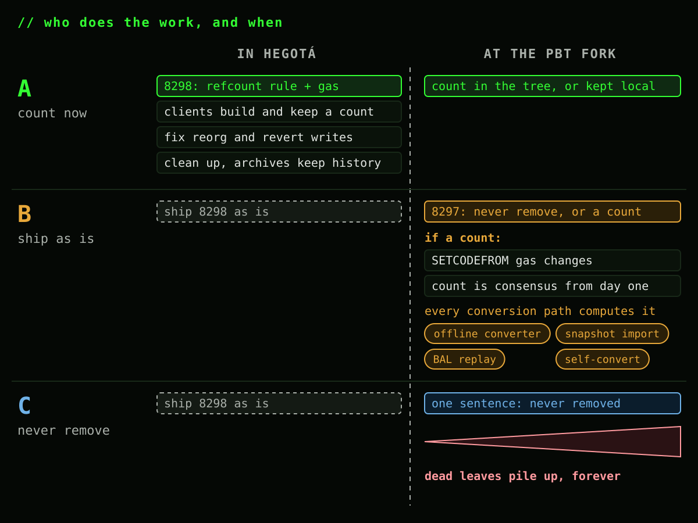

# Who cleans up the code? SETCODEFROM and the bytecode nobody points at

*Every client already keeps bytecode that no account points at. That never mattered, because code sits outside the state root. SETCODEFROM lets any transaction add to the pile, and the partitioned binary tree moves code inside the root.*

Sync the same client twice, once with full sync and once with snap sync, and both nodes will agree on every state root. They won't agree on what's in their code databases. The full-synced one keeps bytecode that no account points at anymore: [EIP-8058](https://eips.ethereum.org/EIPS/eip-8058) counted 27,869 of those on a full-synced node, as of Cancun.

That has never broken consensus, and it's small. But [SETCODEFROM](https://eips.ethereum.org/EIPS/eip-8298), proposed for Hegotá, gives every transaction a new way to leave code behind (my [previous article](../setcodefrom-account-modes/) covers what it's for), and the [partitioned binary tree](https://eips.ethereum.org/EIPS/eip-8297) (PBT) moves code inside the state root. Together they turn a harmless leftover into a design decision, and the time to make it is now, while 8298 is still a draft.

## Same chain, same root, different code

The state root commits to every account's code hash, never to the code itself. The bytes live in a side table, hash to code, that each client fills and keeps however it likes. Consensus needs only one thing from that table: the code of every live account is in it. Anything extra is invisible to the root, so nobody ever had to agree on it.

## How code ends up dangling

Code gets written to that table when a client executes a block that deploys it, and in most clients nothing ever deletes it:

- **Reorgs.** A client executes a block on a side branch and writes its new code. The chain picks the other branch, the block's state is undone, and the code stays.
- **SELFDESTRUCT, before Cancun.** A contract deployed in one block and destroyed in a later one loses its account and its storage. In a client that keys code by hash, its code can't go with it: another account may share the same code hash, and the client has no way to know. Only a reference count would tell you. [EIP-6780](https://eips.ethereum.org/EIPS/eip-6780) closed this door in Cancun.
- **Reverted sub-creates.** An inner CREATE succeeds, then an outer frame reverts. Most clients undo the code before it ever reaches disk. Nethermind stages it when it's inserted and writes the whole batch at the end of the block anyway.

Here's every client side by side:

Two things stand out. Reverts aren't the main source: only Nethermind persists code from a reverted frame, the others undo it before anything is written. And only one client doesn't have the problem at all.

Since Cancun, only reorgs and Nethermind's handling of reverts still leave code behind. Fix those two and nothing would anymore, until SETCODEFROM.

## Two ways to store shared code

Erigon stores code per address, with no reference count. When the account goes, its code goes with it, and a thousand clones are a thousand entries. It doesn't pay for them in full, though: its frozen files compress every value against a shared dictionary, so repeated code shrinks to a fraction of a copy (its config notes a 4x ratio for code on mainnet). geth, reth, Nethermind and Besu store code by hash instead: a thousand clones share one copy, and deleting it means knowing nobody else points at it. That's a reference count, and none of them keeps one. Besu has been on both sides: older Besu databases keyed code by account, new ones key it by hash.

Compression can't do that job inside a tree, where every copy would be another committed leaf. So PBT keeps one copy per code hash, and inherits the same question.

## How big is it today? Small

Those 27,869 codes were deployed under the 24 KiB limit, so together they're 0.68 GB at most. Even at the new 64 KiB limit ([EIP-7954](https://eips.ethereum.org/EIPS/eip-7954), scheduled for Glamsterdam), the same count would be 1.83 GB, under 0.7% of a full node's ~280 GB of state. A snap-synced node never even downloads it. Cleaning it up for the disk space alone isn't worth anyone's time.

What it did cost is design freedom. You can't ask a client "do you have code H?", because the answer depends on how it synced. 8058's deduplication discount had to look up the code hash of addresses in the access list instead, and SETCODEFROM takes a source address rather than a code hash for exactly the same reason.

## Code chunking puts code in the root

Chunk code into the state tree, as PBT ([EIP-8297](https://eips.ethereum.org/EIPS/eip-8297)) does and any code-chunking design would, and the root commits to the code bytes, not just the code hash. A 64 KiB contract becomes up to 2,115 leaves of 31 code bytes each, plus roughly a branch node per leaf, all of it consensus state: every full node stores it, snap sync has to serve it, and under [EIP-8369](https://eips.ethereum.org/EIPS/eip-8369)'s AA-VOPS profile even partially stateless nodes keep the whole code corpus.

Store those chunks once per code hash, as PBT does to avoid duplicates, and deleting code becomes a consensus decision. Today it needs no reference count: since Cancun, an account with code can only be deleted in the transaction that created it, and no live account can replace its code, so a code leaf older than the transaction always has a holder the transaction can't remove. 8297 says it outright: a later change that lets a live account replace code "would have to say how the check stays local."

Today's dangling code doesn't come along to PBT, by the way: its converter ([EIP-8347](https://eips.ethereum.org/EIPS/eip-8347)) reads code only through live accounts' code hashes.

## SETCODEFROM makes any transaction the last holder

SETCODEFROM is that later change. When the last account holding some code adopts different code, the old code has no holder left. Under the MPT that's one more entry in a table nobody agrees on, and sync sheds it. Under PBT it's 2,115 leaves inside the root, and removing them needs exactly the count nobody keeps.

The flows SETCODEFROM was written for barely trigger this. A source keeps its code, so anything adopted from a template always has at least one holder. What dangles is the original code of a contract that upgrades itself in place, or a template that changes its own code after everyone else left. And those bytes were paid for: under [EIP-8037](https://eips.ethereum.org/EIPS/eip-8037), deploying 64 KiB costs about 100M state gas, while orphaning it costs 12,200 gas. SETCODEFROM doesn't make state growth cheaper. It makes paid state impossible to take back.

> That's the part I care about most. **Without a count, dead code in the tree is there forever**: every node stores it, syncs it and serves it, and every AA-VOPS node carries it too. With a count, SETCODEFROM becomes the first way since Cancun to take code back out of state.
>
> And we can't predict the future. Any use case that deploys unique code and later adopts something else leaves a trail of dead code: an upgrade-heavy protocol, say, or per-user deployments that migrate to a shared template. How long that trail gets, nobody knows, and **once it's in the root it stays**.

## Three ways to ship it

**A. Count now, in Hegotá.** 8298 drops code once its last holder replaces it, prices SETCODEFROM for that, and keeps the address operand. Clients build the count and fix their reorg and revert writes; PBT only picks where the count lives. And count bugs show up under the MPT as a leak or a stall, long before they could touch a state root.

**B. Ship as is, let PBT decide.** Nothing changes in Hegotá. PBT later either never removes replaced code (that's C) or adds the count then: a SETCODEFROM gas change, a count that is consensus-critical from day one, and every conversion path computing it identically.

**C. Never remove, by spec.** One sentence in whichever EIP ships second, no new machinery, and dead leaves stay in the root forever. Today that costs nothing extra, since nothing leaves the code zone after Cancun anyway. Tomorrow, nobody knows.

## Where I stand

I'm biased here: I co-authored the PBT EIPs and I want to see them ship. But I think we can all agree they're already complex. And there's more than one way into the tree: people converting their own nodes, people importing a converted snapshot, nodes following along with BAL replay. Under B, every one of those paths inherits a fix we could have made in 8298 with a bit more work.

So I'd rather do A. Decide it while 8298 is still a draft, build the count where its bugs are cheap, and hand PBT a solved problem instead of another EIP's tech debt.

## Cheat sheet

