# Is the slot-0 reorg cost fixable, or do we have to live with it?

*Glamsterdam has to pick where the attestation deadline sits — second 2, 3, or 4 of the slot — and the epoch boundary is the reason that choice is hard. Twenty-one months of mainnet data point to fixable production engineering rather than a structural protocol floor: one exchange alone causes ~18% of all epoch-boundary reorgs. So the deadline can come down — but to ~3s, not 2s, and not before the slow path is fixed.*

## TL;DR

**Verdict: the slot-0 reorg cost is dominated by slow, locally-built blocks concentrated in a few operators — fixable production engineering, not a uniform protocol toll. Set the dial at ~3s now; earn 2s at a later fork once the slow path is fixed.**

- **The phenomenon:** the first slot of each epoch is orphaned **~7× more often** than any other (1.17% vs 0.16%). In aggregate the excess is tiny — **~1 block in 3,200** — but slot 0 is the *worst-case* slot, and a single global deadline must clear the worst case, so this small rate gates a scaling lever worth ~a second per slot.
- **What discriminates a victim from a survivor:** its **own lateness** (first-seen ~4.4s vs ~2.1s), being **locally built rather than relay-delivered** (~62% vs ~11%), carrying **more blobs** (median 5 vs 4 — the DA-propagation burden), and **operator concentration** — upbit alone orphans 31% of its own slot-0 blocks (~18% of all slot-0 orphans). The parent is on time; the relay is protective, not harmful.
- **The catch:** even among slot-0 blocks that survive *today*, only ~39% are seen by 2s — a 2s deadline now would strip the safety margin from most of them. And the slot-0 rate has been *rising* (≈0.6% → 1.7% over the window), so the dial should be set against today's regime, not the 21-month average.

## The decision Glamsterdam has to make

Glamsterdam ships enshrined proposer–builder separation [(ePBS, EIP-7732)](https://forkcast.org/upgrade/glamsterdam/#eip-7732), which restructures the slot into explicit deadlines — block construction, payload reveal, attestation — and in doing so turns the *attestation deadline* from a hard-wired constant (today `SECONDS_PER_SLOT / 3` = **4 seconds**) into a **parameter the fork must choose**. That choice is the motivation for this work.

It is a throughput dial. The deadline is the moment validators vote: a block not seen by then loses the head vote and can be reorged. Moving it **earlier** — to 3s, or 2s — hands the reclaimed budget to execution and payload propagation under ePBS. 
A second is ~8% of a 12-second slot, and propagation headroom is precisely what caps how high the gas limit and blob count can safely climb.

Glamsterdam is already pushing the gas limit upward (toward a ~200M target) and raising blob throughput; that increase is only safe if the larger blocks still reach attesters before they vote — the very budget the deadline governs. **So the dial setting and the gas-limit increase are two ends of one lever, and a deadline set too low doesn't just cost reorgs, it caps how far the rest of the upgrade can push**. 

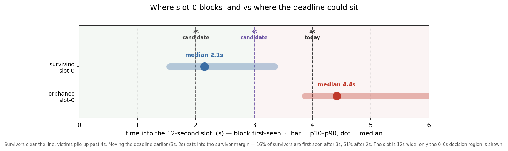

The standing objection to a low setting is the epoch boundary. Slot 0 carries the epoch transition — finalization bookkeeping, the RANDAO reshuffle, new committee assignments — and is reorged out far more than any other slot. 

If that is the inherent price of doing epoch-transition work, it is a hard floor under the deadline. So the question that decides how low Glamsterdam can go is concrete: **is the slot-0 reorg rate a structural cost, or fixable engineering?**

---

## The phenomenon, and whether it even matters

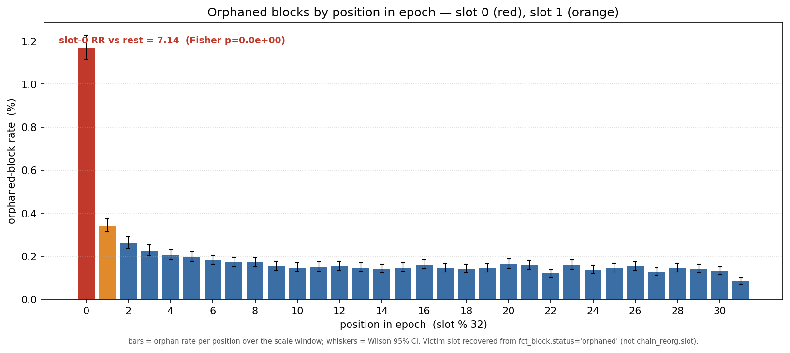

Counting orphaned blocks by position in the epoch, slot 0 sits at **1.17%** against a pooled **0.16%** elsewhere — a **risk ratio of 7.1x**.
Slot 31, by contrast, is the *least*-orphaned position (0.085%): the fork-choice rule protects the last slot of an epoch from honest reorg, so the cost lands one slot later, on slot 0.

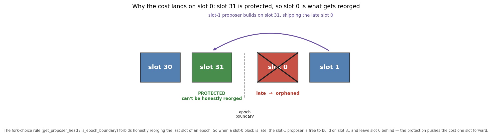

Is a 7× elevation worth a post? In aggregate it is small — the slot-0 *excess* over baseline is ~1,428 blocks in 21 months, **0.031% of all blocks, about 1 in 3,200**. 

**The case for caring is not the aggregate; it is that slot 0 is the worst-case slot and the deadline is a single global number that must clear the worst case. You cannot lower the dial past where slot-0 blocks land without spiking reorgs *there*, so this small, localized rate is what gates a network-wide scaling lever. That is the whole reason to chase it down.**

---

_Now the hypotheses, each stated as the intuition someone reasonably holds, then taken to the data._

## Hypothesis: it is unavoidable epoch-transition work

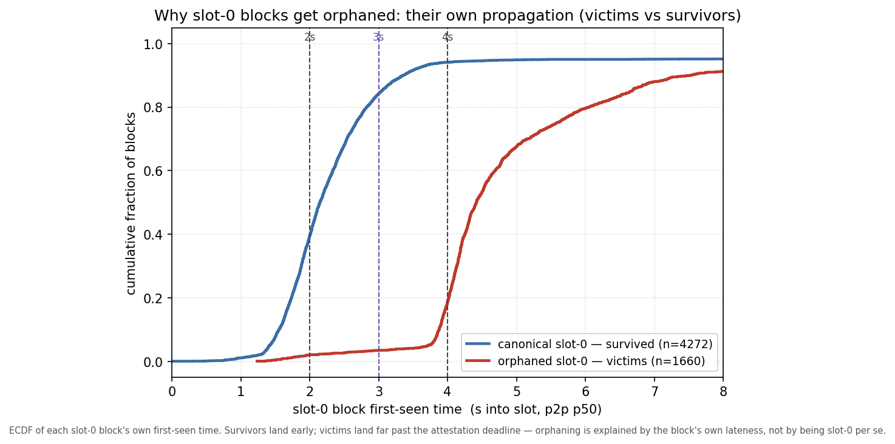

**If the reorging were the protocol doing necessary work, slot-0 blocks would fail roughly uniformly. They do not**. 
Comparing orphaned slot-0 blocks (victims) against slot-0 blocks that survived, on one variable — how late each was first seen — the distributions barely overlap: survivors land early (84% by 3s, 94% by 4s, median 2.1s); victims land late (3.5% by 3s, 18.8% by 4s, median **4.4s**), piling up around and past the deadline. 

That is inconsistent with a *uniform* structural toll: the boundary does not orphan slot-0 blocks evenly; *slow* slot-0 blocks orphan themselves, and most slot-0 blocks are not slow. The model does not include a direct epoch-transition compute term (no per-node compute data exists in the set), **so this rules out a uniform cost rather than every heterogeneous one** — the rest of the post is about *why* the slow ones are slow, which is what separates "fixable" from "structural-but-uneven."

## Hypothesis: a late or withheld slot-31 parent triggers it

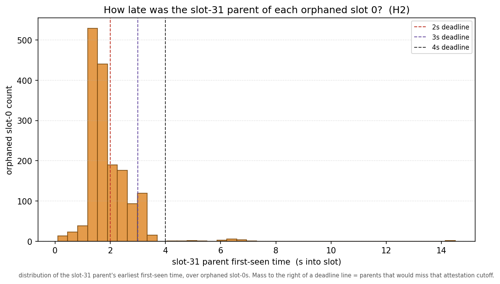

The cleanest "we can't help it" story is the parent: a late or missed slot-31 block could force an ex-ante reorg of slot 0, and since slot 31 is protected, a proposer could even withhold it deliberately. Neither holds. 
For orphaned slot-0s, the parent was seen at a median of **1.7s** (9% later than 3s), and **97% of orphaned slot-0 blocks built on their parent** (of the parents resolved, 1,642 of 1,660). 

_It was there, on time, and used — and the block was orphaned anyway. The withholding variant is absent too: only ~2% sat on an *orphaned* parent. Whatever is slow is on the slot-0 side, not inherited._

## Hypothesis: relay timing games — the bid-return deadline eats the budget

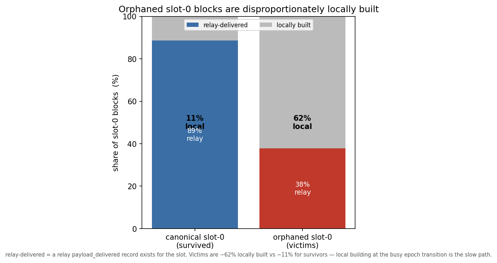

The suspicion is the MEV-Boost path: builders return bids against the ~1-second bid-return deadline, the proposer waits for the last one, and that second is gone. 
**The data inverts it: it is not the *presence* of a relay that hurts but its absence.**

Only **38%** of orphaned slot-0s were relay-delivered, against **89%** of survivors — orphaned slot-0s are **~62% locally built** (vs ~11%). 
The mechanism runs the bid-deadline concern *forward*: MEV-Boost hands the proposer a ready-made payload and is fast; a proposer that misses the bid window falls back to **building locally**, on its own clients, which at the busiest moment in the epoch is the slow path. 
The lever this points to is reliable relay coverage at the boundary and a faster local-build fallback — not, as one might first guess, a lower bid-return cutoff (our bid-timing columns are too noisy to use, and a tighter cutoff could just as easily *push* proposers into the slow local path). (Local building is the dominant route to a late block, not the only one — see operators.)

## Hypothesis: it's the blobs — heavy blocks propagate slower

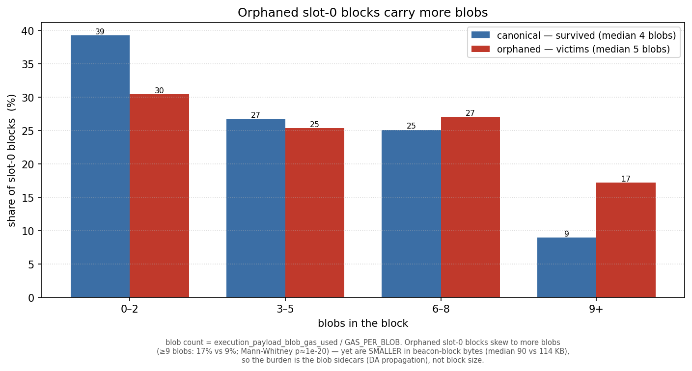

_The intuition: a block's real propagation cost is its blob sidecars, not the beacon block the validator signs — and a local builder, without a relay's tuned delivery, may pack more blobs (up to the protocol maximum, now 21) into a slot-0 block and choke on the upload. A related intuition: rollups might cluster their blob submissions by epoch position, loading particular slots._

**Verdict: supported — and it pinpoints the mechanism.** Orphaned slot-0 blocks carry **more blobs** than survivors: median 5 vs 4, with the heavy tail doing the separating — **17% of victims carry ≥9 blobs versus 9% of survivors**.

Tellingly, the orphaned blocks are *smaller* in beacon-block bytes (median 90KB vs 114KB), so the burden is not the block the validator signs — it is the **blob sidecars**, each a separate ~128KB object that must propagate and be made available before the network will build on the block. And the blob-heaviness concentrates in exactly the slow path: among orphaned slot-0s, the locally-built ones are blob-heaviest (≥9 blobs: 19% local vs 13% relay-delivered).

The "rollups cluster blobs at slot 0" version does **not** hold. Averaging blobs by epoch position over 21 months, the load is essentially flat — slot 0 (3.70) sits at the cross-position mean (3.72), with no spike at slot 0 or at the mid-epoch slots rollups are rumored to prefer. So this is not "slot 0 carries more blobs"; it is "blob-heavy blocks, wherever they land, propagate slower — and at slot 0 the deadline pressure plus local building tips the slow ones over."

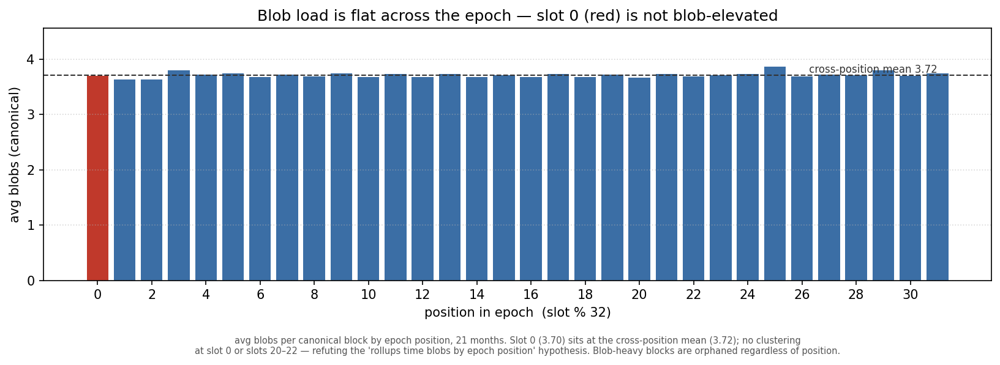

How much of the orphaning does this explain? Adding blob count to the case-control logistic, the lateness effect is unchanged (still ~8× the odds per doubling of first-seen) and blob count adds only a small *independent* signal (≈1.04× the odds per extra blob). Read together: blobs are a **driver of the slow propagation**, acting largely *through* the first-seen lateness the model already captures, not a separate structural cost. 

That keeps the cost squarely fixable — and hands it a concrete, named lever: a [**max-blobs flag for local builders (EIP-7872)**](https://eips.ethereum.org/EIPS/eip-7872), so a fallback local build does not pack 21 blobs it cannot upload in time; and ePBS, which moves the blobs and the payload out of the attestation-relevant block entirely.

## Hypothesis: specific consensus clients are slow at the boundary

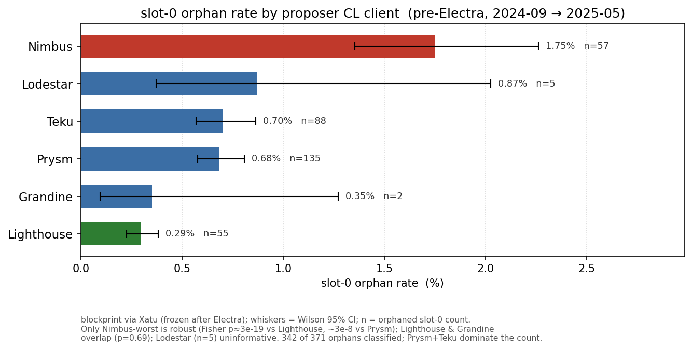

This is the question that makes "fixable engineering" concrete, and it is where the data is both strongest and most limited. 

**Where client labels exist, the answer is yes.** Pre-Electra (through 2025-05-07), blockprint labels each proposer's client: across 371 orphaned slot-0s (342 classified), **Nimbus is robustly worst**; the rest are closer than the point estimates suggest.

By volume, Prysm and Teku produce most orphaned slot-0 blocks (223 of 371) simply because they are ~58% of proposers. This is a genuine client effect — 371 *distinct* validators across many cohorts — not the operator effect, which lives in a different period. (These per-client rates are unadjusted and blockprint is noisiest on minority clients like Nimbus, so treat the ranking as a lead — and the obvious confound is tested next.)

One could argue that Nimbus skews toward home-stakers who self-build, so its gap could be a build-path artifact rather than a client trait. The data only partly bears that out. 

**Build path is the dominant axis** — *every* client orphans ~5–10× more on locally-built slot-0 blocks than on relay-delivered ones (Nimbus 3.6% local vs 1.5% relay; Lighthouse 1.5% vs 0.08%). 
But Nimbus does **not** self-build more than the rest (≈14% local, the same as Lighthouse and Prysm), and it stays the worst client in *both* strata — significantly above Lighthouse within the local-build set (p ≈ 5e-3), though not separable from Prysm there (small n). 
So the Nimbus signal is not a build-path artifact; it is more likely operator population or blockprint's known minority-client error. Either way the build-path result is the load-bearing one: it is *where* a block is built, far more than *which client* builds it, that decides whether a slot-0 block survives — which is exactly the fixable lever.

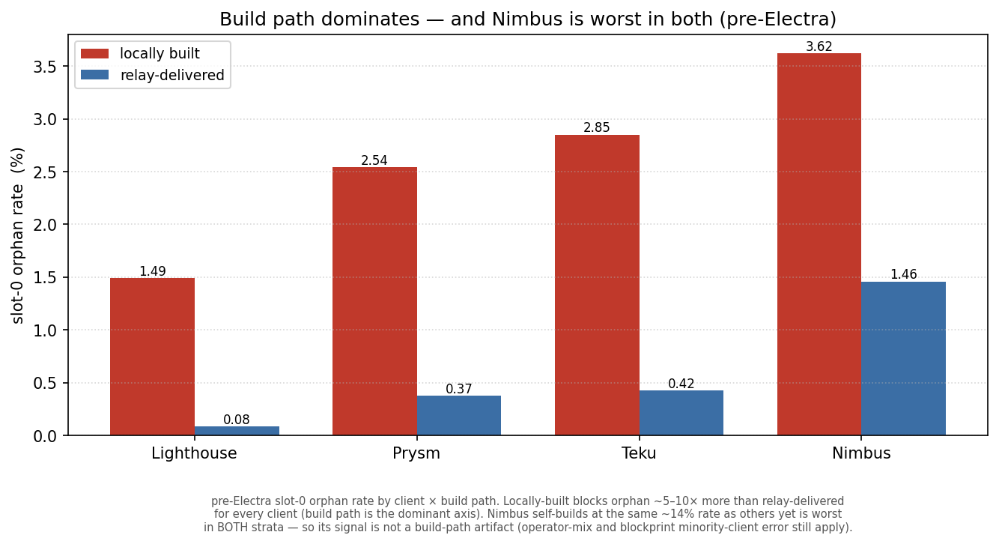

**After Electra the signal is gone — and the cause is itself the finding.** Blockprint fingerprints a client by its attestation packing; EIP-7549, shipped *in the same Electra fork* whose reorgs this studies, collapsed that signal (~1,366 → ~22 attestations behind a supermajority), so the fingerprint is destroyed at the source.

Crucially, the verdict does not depend on naming the current client: "fixable, not a uniform structural cost" rests on the lateness, the local-build path, and the operator concentration — all client-independent. The gap costs us *which client* to fix today, not *whether* it is engineering. 

## Hypothesis: a few operators carry it

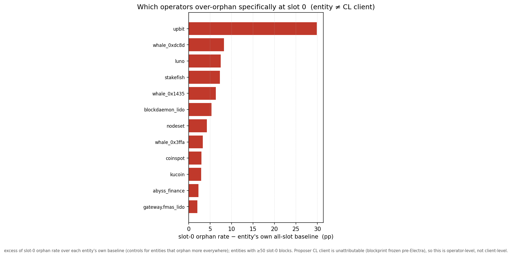

If this is fixable engineering it should be concentrated — and it is. 

Against each operator's own all-slot baseline, **upbit orphans 31% of its own slot-0 blocks and accounts for ~18% of every slot-0 orphan in the dataset**; a handful of others follow. 
Two honest qualifications. The largest single bucket is *unattributed* (~24.5% of orphans), so the concentration is a lower bound. And it overlaps the local-build finding, unevenly: upbit's orphans are **97% locally built** (its problem *is* the slow local path), another large operator ~87% — yet stakefish and blockdaemon_lido are orphaned despite being ~63% relay-delivered, so for them the slowness is elsewhere in the pipeline and the fixable-engineering story is, honestly, unverified: this relay-delivered residual is where "something structural about that operator" stays live. 

For the dominant local-build set, though, the pattern is operator-specific and chronic — the worst operator's orphans span dozens of separate days — the texture of a fixable configuration or software problem, not bad luck. "Fixable" here means *strongly indicated by a known-addressable correlate*, not proven by an intervention; no operator has yet fixed its setup and shown the rate drop.

## The trend: a rising rate, not a steady one

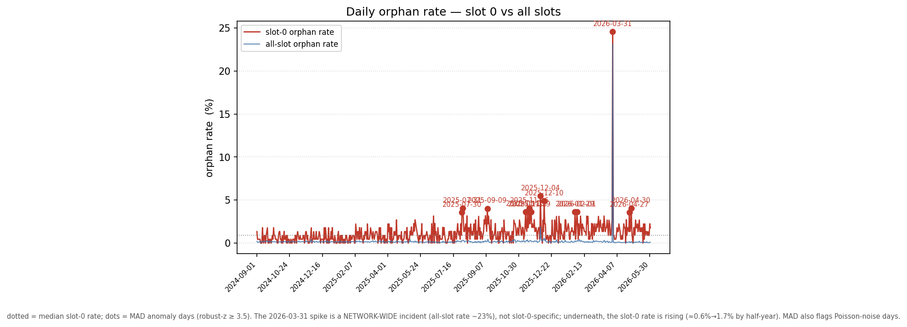

A search for a dramatic incident turns up exactly one in 21 months: on 2026-03-31, 24.6% of slot-0 blocks were orphaned — but that day's *all-slot* rate was 23.2%, a network-wide event, not a slot-0 phenomenon. 

Removing it *raises* the slot-0 risk ratio (to 8.87), so it is conservative for the argument. Underneath the noise, the slot-0 rate is not steady — it has roughly tripled, climbing by half-year from **0.58% (2024-H2) → 0.83% → 1.43% → 1.73% (2026-H1)** while the all-slot baseline stayed near 0.15–0.29%. For a dial being set now for a future fork, the decision-relevant number is the *current* regime (~1.7%), not the 21-month pooled 1.17% — and the upward trend makes fixing the slow path more urgent, not less.

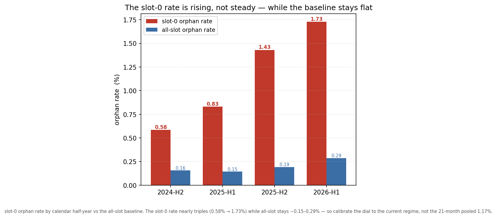

And the rising rate is not a mystery: the blocks themselves are growing. Over the same window the average slot-0 beacon block grew **~60% (106 → 170 KB)** and blob loads rose with it, while the all-slot orphan baseline stayed flat — so the slot-0 reorg rate climbs in step with the propagation burden, exactly the mechanism the sections above describe. This is also why ePBS *helps*, and helps more as blocks grow: gas-limit increases, Fusaka's 14/21 blobs, and Glamsterdam's block-level access lists all enlarge the block — and ePBS moves every bit of that (payload, blobs, BAL) out of the small beacon block attesters actually vote on. The bigger blocks get, the more the attestation-relevant object shrinks relative to them, and the more headroom a post-ePBS deadline reclaims. The growth cuts toward the thesis, not against it.

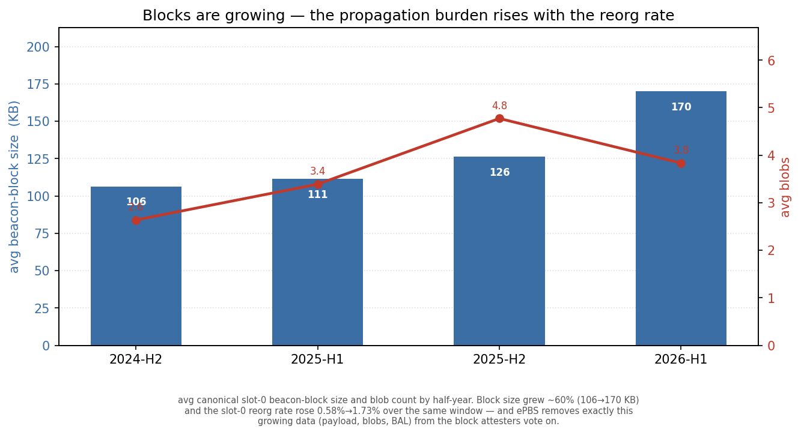

## Back to the dial: what should Glamsterdam set?

Read each candidate against the data, as the share of *today's surviving* slot-0 blocks the move would strip of their timing margin. (A caveat on these numbers: being first-seen after the deadline removes a block's safety margin; it is an **upper bound** on new orphans, not a predicted orphan rate — a block seen at 2.1s under a 2s
deadline still collects most votes. Read them as risk exposure, not casualty counts.)

- **4s (status quo):** the safe floor today; ~94% of slot-0 blocks already clear it.
- **3s:** ~16% of today's survivors are first-seen after 3s — and that exposed tail is overwhelmingly the same late, locally-built, operator-concentrated set already slated for the fix, so the residual risk is addressable rather than ambient. A defensible Glamsterdam landing spot.
- **2s:** ~61% of survivors are first-seen after 2s (~32% after 2.5s). This would not trim a slow tail; it would strip the margin from the bulk of slot-0. Premature *today*.

Two reviewer points sharpen the 2s line — and the data sharpens them back. First, today's first-seen carries some relay/timing-game overhead a locally-built (or post-ePBS) block would not; but in our data that overhead is modest, not the second sometimes assumed — among *surviving* slot-0 blocks the relay-delivered ones are only ~**190ms** later at the median than locally-built ones, and lower-blob blocks are only marginally faster (42% vs 39% seen by 2s). Second, and more decisive: those at-risk shares are the *current* big-block regime, and ePBS sheds the payload, blobs, and BAL from the block attesters vote on, so the same proposers should land earlier after the fork. Both say the 2s exposure here **over-states** the post-ePBS world — which is the case for *measuring* 2s after Glamsterdam rather than assuming it now.

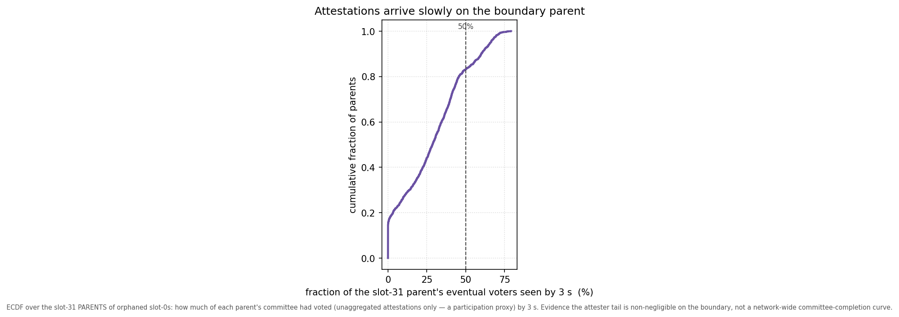

One more constraint argues against an aggressive cut, with a provenance caveat. Part of the budget is owed not to proposers but to **slow attesters**. 

The closest measurement here is attestation *arrival* on the slot-31 parents of the orphaned cohort: of those parents' eventual voters (counting unaggregated attestations only, a participation proxy), a median of just **~29% are observed by 3s, ~47% by 4s**. 

That is a deliberately worst-case object — the slowest position's parents — and a proxy, not a network-wide committee-completion curve, so it is evidence that the attester tail is *not negligible*, not a precise bound. It is also a different quantity from the dial numbers above (attestation arrival vs block first-seen): the 3s recommendation rests on block propagation (84% of survivors in by 3s), while this says faster block production alone would not make a *2s* cut free, because attestations themselves keep arriving well past 2s. And per-slot timing is coupled to the gas-limit adjustment, so fewer reorgs trade against fewer timing games.

So the recommendation for Glamsterdam is an ordering, not a single number:

1. **Land the dial at ~3s, not 2s** — most of the scaling win at bounded, measured exposure, calibrated to the current (rising) regime.
2. **In parallel, fix the concentrated slow path** so a later fork can go lower. It is concrete and named: the over-orphaning operators (upbit first — 18% of the problem in one place — then the handful behind it) are the ops target; Nimbus was worst pre-Electra (through 2025-05-07; unadjusted for build path and the classifier is noisiest for minority clients) — a lead for client teams to re-verify, not a settled target.
The data localizes the slow path to local block-building at the boundary; the precise client-internal cause is not measured here. A plausible contributor is epoch-transition *state processing* (the post-state root the slot-0 block must commit to), plus a **max-blobs flag for local builders (EIP-7872)** so a fallback build does not pack 21 blobs it cannot upload in time.
3. **Re-measure after Glamsterdam** — ePBS decouples the payload (and blobs) from the beacon block, but the slot-0 bottleneck is on the consensus side it does *not* decouple, so the post-fork floor may move less than the general headroom implies. That makes the next step down something to measure, not presume.
4. **Two things widen the room.** A conservative deadline change may not even need a hard fork: the attestation deadline is a fork-choice/timing policy, changeable by coordinated client release (the precedent is proposer boost), so the safe first step can ship ahead of the fork — while pricing/gas changes still require one. And a separate [**BAL deadline (EIP-8146)**](https://eips.ethereum.org/EIPS/eip-8146) can buy execution-side headroom *without* touching the attestation deadline at all: if the block-access-list sidecar must arrive ~1s before the payload-attestation deadline, the EL can prefetch state and begin the post-state-root computation early — directly attacking the consensus-side bottleneck this study points to.

## Limits and open questions

- **Post-Electra consensus-client attribution is unavailable** — structurally (EIP-7549), and confirmed dead across blockprint downstreams *and* graffiti. The strongest client claim is pre-Electra; whether the Nimbus gap persists is open, pending a post-Electra classifier (MigaLabs inquiry outstanding).
- **"Fixable" is strongly indicated, not proven.** It rests on a correlate (local build) and operator concentration, not on profiling or a before/after intervention; the relay-delivered over-orphaners are an unexplained residual.
- **"Late ⇒ orphaned" is partly definitional**, but first-seen is the *earliest* sentry sighting (a `min`), so it reflects when a block hit the network, not how widely it was re-gossiped — guarding the reverse-causality reading — and the effect survives adjustment for relay/local build and era. First-seen is a publish-side proxy, not attester reception, which the deadline ultimately tracks.
- **Operator ≠ client**, ~24.5% of orphans are unattributed, the control cohort is a time-stratified sample (the gap holds within era), the attester-timing measurement is a slot-31-parent participation proxy, and epoch-transition compute load could not be measured directly.

## Closing

Glamsterdam has to put the attestation deadline somewhere, and slot 0 is the reason it is a real decision. The data turns an apparent hard floor into a sequencing problem: the cost is not a uniform protocol toll but a slow block, disproportionately self-built by a small set of operators, landing just after the line — and one exchange accounts for a fifth of it. Set the dial at ~3s now, name and fix the concentrated slow path (reliable relay coverage and a faster local-build fallback), and let a later fork — measured on post-ePBS data — earn the step to 2s. The reorgs at the epoch boundary are not the price of scaling Ethereum; they are a short list of things to fix so that scaling can proceed.
